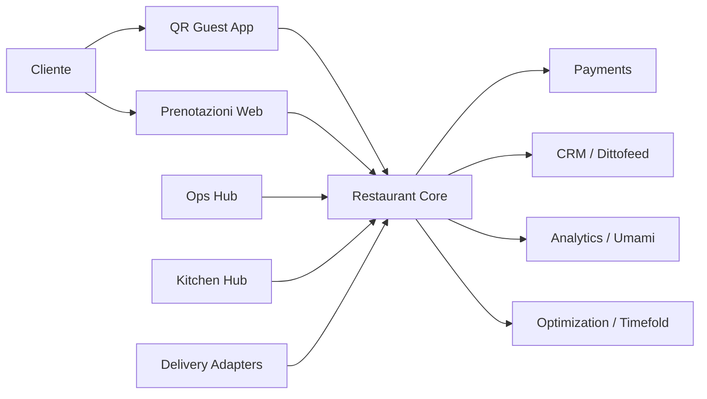

# Architettura Proposta

## Scelta

Architettura consigliata: `core proprietario + moduli OSS mirati`.

Non consiglio una sola repo come base totale. Le funzionalita' che vuoi coprire sono troppo trasversali:

- hospitality operations
- reservation engine
- QR ordering
- pagamento al tavolo
- split bill
- delivery orchestration
- CRM e marketing automation
- analytics

## Moduli

### 1. Restaurant Core

Responsabilita':

- sedi e brand
- sale, aree, tavoli
- menu, categorie, varianti, allergeni
- ordini dine-in, takeaway, delivery
- prenotazioni
- stato tavolo
- staff e ruoli
- pagamento e conti

Entita' principali:

- `Brand`
- `Location`
- `DiningArea`
- `Table`
- `TableSession`
- `Menu`
- `MenuCategory`
- `MenuItem`
- `ModifierGroup`
- `Order`
- `OrderItem`
- `Reservation`
- `Guest`
- `StaffMember`
- `Shift`
- `Bill`
- `BillSplit`
- `Payment`

### 2. QR Guest App

Responsabilita':

- accesso da QR univoco per tavolo o sessione tavolo
- menu mobile first
- carrello condiviso live
- richiesta cameriere
- riordino al tavolo
- pagamento parziale o totale
- split bill per persona o per item

### 3. Ops Hub

Responsabilita':

- dashboard hostess per prenotazioni
- mappa tavoli e assegnazioni
- POS cassa
- monitor sala
- gestione ordini takeaway e delivery
- monitor performance location

### 4. Kitchen Hub

Responsabilita':

- coda ordini real-time
- ticket per postazione
- tempi di preparazione
- mark as preparing / ready / served
- priorita' e SLA

### 5. Delivery Adapter Layer

Responsabilita':

- normalizzare ordini da app esterne
- mappare menu e disponibilita'
- sincronizzare stati ordine
- unificare flussi tra delivery esterno, asporto e consumo in sede

### 6. CRM / Marketing Layer

Responsabilita':

- profilo cliente unico
- consenso marketing
- segmentazione
- newsletter email
- campagne WhatsApp
- automazioni post-prenotazione / post-visita / carrello abbandonato

### 7. Analytics Layer

Responsabilita':

- conversione prenotazioni
- conversione scan QR -> ordine
- tempo medio tavolo
- resa per sala, sede, turno, cameriere
- piatti trainanti
- clienti ricorrenti e LTV

## Flusso Alto Livello

## Motore Di Ottimizzazione

`Timefold` va usato solo dove serve davvero:

- suggerire tavolo migliore per prenotazione
- evitare overbooking tra sale e fasce orarie
- comporre turni staff minimizzando buchi di copertura
- suggerire dispatch delivery locale

Non deve bloccare il core transactionale. Deve lavorare come motore di suggerimento o job asincrono.

## Strategia Tecnica

### Cio' che farei subito

- core eventi e dominio originale
- API-first per alimentare backoffice, QR app e integrazioni
- stato real-time con websocket o broadcasting
- payment adapter astratto
- delivery adapter astratto

### Cio' che non farei subito

- ERP totale
- payroll completo
- loyalty complessa
- motore promozioni troppo sofisticato
- analytics enterprise dentro il core

## Decisione Di Prodotto

La parte che vale davvero costruire in casa e':

- sessione tavolo
- carrello condiviso live
- split bill nativo
- unificazione tra prenotazione, consumo al tavolo e delivery
- vista operativa unica multisede

Il resto va accelerato con OSS o integrazioni.
